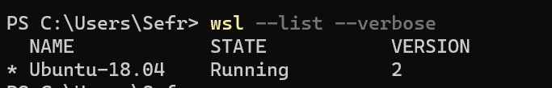
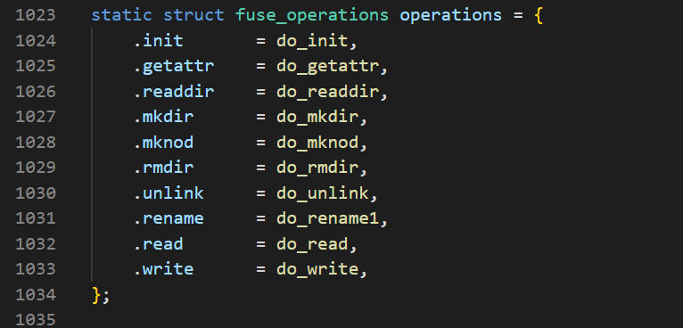
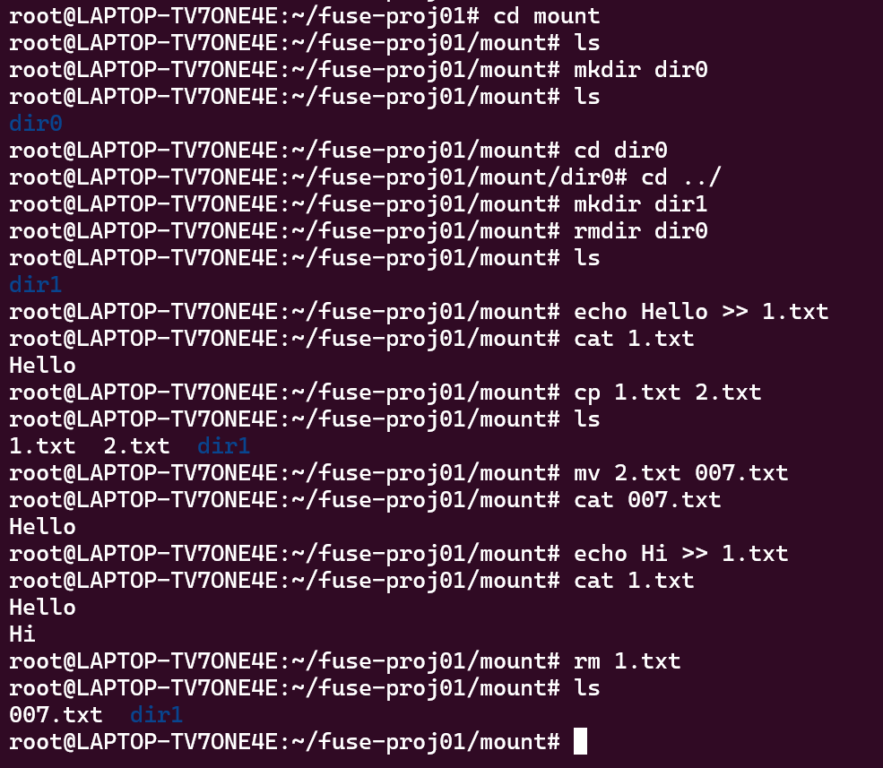
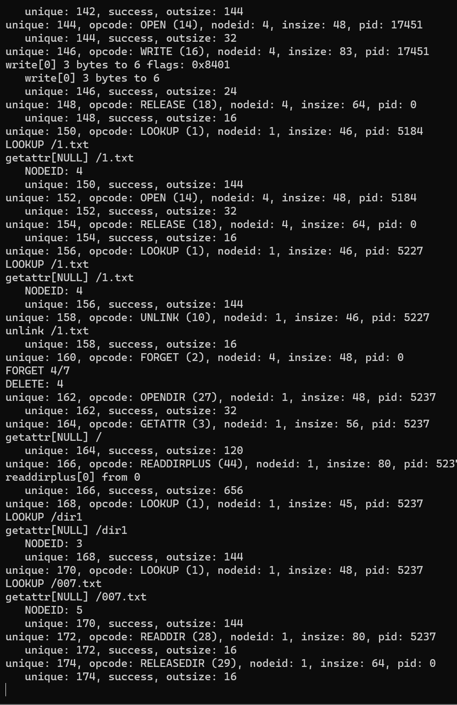

# 超级简单的 Fuse 文件系统 ufs 实验报告

曾千洋 2018011372


### 运行

ufs 文件系统基于C语言实现，实现源代码全部在 `fuse-proj01/ufs.c` 中。

运行环境为 WSL2，Ubuntu-18.04。



运行脚本在 `fuse-proj01/script/test.sh` 中。

```bash
set -e
set -o xtrace

gcc -Wall ufs.c `pkg-config fuse3 --cflags --libs` -o ufs

rm /tmp/disk  # mark it if /tmp/disk not exist
touch /tmp/disk
fallocate --length=2g /tmp/disk

rm -rf mount  # mark it if mount not exist
mkdir mount
./ufs -d -f mount
```


### 功能

##### 实现思路

设计文件元数据 `inode` ，将文件元数据与文件内容都存入一个模拟磁盘文件 `/tmp/disk` 当中。

为了简单起见，本项目的文件系统是一个扁平化的工作系统，没有实现多层级的目录结构，只有一个根目录，其他的文件和目录均存在根目录当中，节省了工作量，当然也跑不了一些基本的项目了（比如我的期中 KV-Store 项目）。


##### 基本接口

注册并实现了如下的 fuse 文件系统 API：



在 `main` 函数的开始，负责初始化磁盘的不同区域。磁盘文件 `/tmp/disk` 按照块（`BSIZE=4096`）对齐，分为 inode 区域（`0-1023 Blocks`，存取文件元数据）、bitmap 区域（`1024-1031 Blocks`，存储file data区域中的块是否有效）、file data区域（`1032-262144 Blocks`，存储文件内容）。同时，也初始化内存当中的 `inode` 。

`getattr` 函数获取文件的属性，最重要的属性就是文件类型是`directory`还是`file`。

`readdir` 函数获取目录下的所有文件名。本项目当中，只允许对根目录应用该函数，因此就是遍历根目录下的所有文件信息，获取相应的文件名。

`mkdir` 、`mknod` 函数创建一个新目录/新文件，`rmdir` 、`unlink`函数删除一个空目录/文件。需要更新对应的磁盘区域。

`rename` 函数重命名一个文件/目录。

`read` 函数读取一个`file`文件的内容；`write` 函数写入一个 `file` 文件的内容。


##### 实现功能



由于没有实现多层级的功能，所以这些功能都只能在项目根目录下执行。

fuse端的输出（只截取了最后的一小段）：

